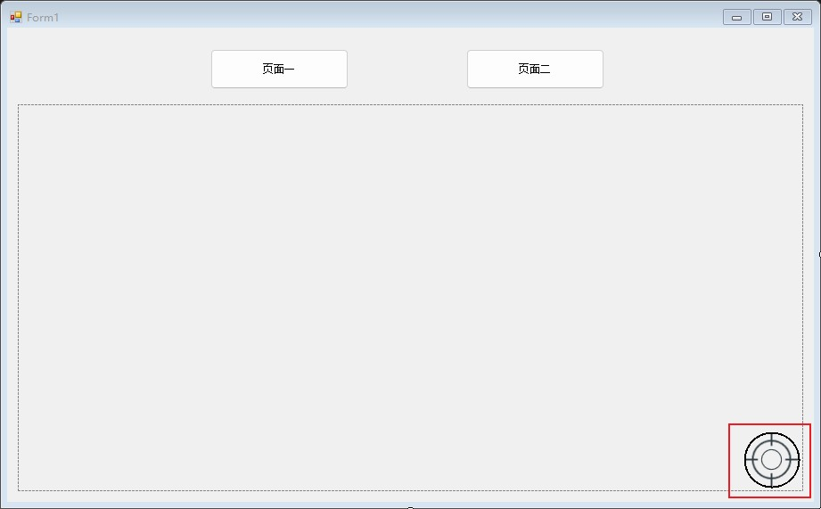

# Winform-Navigator

## Introduction
Winform. Navigator is a page navigator for Winform, where the "page" can be a Form or a user control that inherits from the Control class.

## Install
Nuget:https://www.nuget.org/packages/Winform.Navigator  
GitHub:https://github.com/hlz2516/Winform.Navigator

It is recommended to directly search for "Winform.Navigator" in the Nuget Manager for installation.

## Function
There are two main classes in the Winform. Navigator package, 
one is **Navigator** and the other is **Router**, both of which support the following functions:  
- Switch pages and include parameters when switching pages
- Can set page caching and customize actions when cached and when restoring state
- Support setting page permissions
- Provide DefaultPageFirstShown,PageChanged and PageBeforeChanged events (similar to Global Before Guards and Global After Hooks in Vue)

Here are their differences:
- Navigator is a user control, so you need to drag it out of the toolbar and drop it into the page container.However, Router is a class, so it doesn't have this step
- Each page class needs to be registered with the Navigator (in the code).But the Router only needs to configure routing in the app. config file(in the xml file)
- Router needs to write the Route feature for each page class, while Navigator does not

## Basic Use

**When you use it, please choose one of the following to use it.**

### Use Navigator

1. Add Navigator control to container,such like this:
  
The red box represents the Navigator control.

2. Set application user identity/permissions. (It's optional, if you need a simple authentication mechanism)
```c#
static void Main()
{
    Application.EnableVisualStyles();
    Application.SetCompatibleTextRenderingDefault(false);
    Navigator.EnableAuthority = true;  //Enable authentication property, default to false
    Navigator.Navigator.SetRole(Navigator.Authority.VISITOR | Navigator.Authority.USER); //This step is to set the user role of the application as visitor+user
    Application.Run(new Form1());
}
```
The SetRole method does not have to be written in the Main method, but can also be written in the construction of the main form. Just note that it must be called before the default page is displayed (if there is a default page) or before the page is switched, because each time you switch to a new page, an authentication operation will be performed  

3. Inherit IPage interface to the class which used as page.
```c#
public partial class Page1 : Form,IPage
{
    public string Path { get; set; } // only Router will use this prop
    public bool Cached { get; set; } //Set whether the page is cached
    //Set the access permissions for this page. If you enable authentication, each time you jump to the page,
    //the permission attributes here will be compared with the user role permissions. 
    //If the page permissions do not intersect with the user permissions, a permission mismatch event will be triggered
    public Authority Authority { get; set; } = Authority.VISITOR;
    ...
    public void Pause()  //This method will trigger when switching to another page
    {

    }

    public void Restore()  //This method will trigger when switching back to the page and setting the cache
    {

    }

    public void Reset()  //This method will trigger when switching back to the page and setting no caching
    {

    }
}
```

4. Register the Form class that inherits IPage with the navigator. This step can be completed in the constructor or Load event of the main form
```c#
private void Form1_Load(object sender, EventArgs e)
{
    navigator1.RegisterPage<Page1>();
    navigator1.RegisterPage<Page2>(true);  //Default page can be set during registration
}
```

5. Write jump logic for buttons
```c#
private void button1_Click(object sender, EventArgs e)
{
    navigator1.NavigateTo<Page1>();
}

private void button2_Click(object sender, EventArgs e)
{
    navigator1.NavigateTo<Page2>();
}
```

### Use Router£¨recommend£©

1. Find the **App. config** file in the project, open it, and add the routes item configuration. After the configuration is completed, it is shown as follows:
```xml
<?xml version="1.0" encoding="utf-8" ?>
<configuration>
    <startup> 
        <supportedRuntime version="v4.0" sku=".NETFramework,Version=v4.7.2" />
    </startup>
  <!--step 1:configure the routes here-->
  <routes>
    <route defaultPage="true">
      <path>/page-jump/page1</path>
      <name>jumpPage1</name>
    </route>
    <route>
      <path>/page-jump/page2</path>
    </route>
  </routes>
</configuration>
```

For more rules on route configuration, please refer to the end.

2. Open Program.cs and call the Router.LoadConfig method before the Application.Run method, as shown below:
```c#
static void Main()
{
    Application.EnableVisualStyles();
    Application.SetCompatibleTextRenderingDefault(false);
    Router.LoadConfig();  //step 2:load the config from step1
    Application.Run(new TestForm1());
}
```

3. Open the background code file of the main form and set the page container during the construction of the main form, as shown below:
```c#
public TestForm1()
{
    InitializeComponent();
    Router.SetContainer(panel1);  //step 3:set page container
}
```

4. Open the backend code file of the form class as the page, let the class inherits the IPage interface and adds the Route attribute to it:
```c#
/**
    *  step 4: Inherit the IPage interface and  add the Route feature to the class which used as page.
    */
[Route("/page-jump/page1")]
public partial class Page11 : Form,IPage
{
    public string Path { get; set; }
    public bool Cached { get; set; }
    public Authority Authority { get; set; }

    public Page11()
    {
        InitializeComponent();
    }

    public void Pause()
    {

    }

    public void Restore()
    {

    }

    public void Reset()
    {

    }
}
```

5. Now you can call the Router.RouteTo method. Let's add two buttons in the main form to jump to page11 and page12 (page12 code is not posted here, but it's almost the same as page11):
```c#
private void button1_Click(object sender, System.EventArgs e)
{
    Router.RouteTo("/page-jump/page1");  //step 5: call RouteTo to route
}

private void button2_Click(object sender, System.EventArgs e)
{
    var paramMap = new Dictionary<string, object>();
    paramMap.Add("TestParam", "It's test word");
    Router.RouteTo("jumpPage2", paramMap); //you can route with params
}
```
----
For more examples, please refer to the demo project code in GitHub repo. The demo is divided into two projects: demo navigator and demo router. The demo navigator is mostly annotated in Chinese, while the demo router is mostly annotated in English.

## XML Config Rule

### routers

- enableAuthority  
type:item attribute  
explain:Whether to enable the page authentication mechanism. 
If enabled, you need to set the Authority property for each page and set the application user role in the program.  
value:true/false.default:false  
e.g:
```
<routes enableAuthority="true">
...
</routes>
```

### route

- defaultPage  
type:item attribute  
explain:if set this page as the default page when the container is first displayed.  
value:true/false.default:false  
tips:Among multiple configured route items, only one can have a default page. 
If multiple default pages are set, the first route configured as the default page is valid.  
e.g:
```
<route defaultPage="true">
    <path>/page-jump/page1</path>
    <name>jumpPage1</name>
</route>
```

- cache  
type:item attribute  
explain:if cache this page  
value:true/false.default:false  

- path  
type:child node  
explain:The routing path for this page  
value:custom  
tips:This node is mandatory  

- name  
type:child node  
explain:The routing name of this page  
value:custom  
tips:This node is optional  